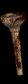
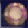
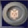
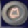
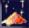
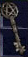

# Misc

All non-equippable items (including Wirt's Leg)

## gold

gold values that are displayed:

| LVL | Value |
| --- | --- |
| 1-40 | 100+ |
| 41-80| 2000+|
| 81+ | 4000+ |

## Potions

### Rejuvenation

| Icon | Name | Hide at LVL | Displayed as |
| --- | --- | --- | --- |
|  | Rejuvenation Potion | 66+ | !35% |
|  | Full Rejuvenation Potion | never | !70% |

### Health

| Icon | Name | Hide at LVL | Displayed as |
| --- | --- | --- | --- |
|  | Minor Healing Potion | 15+ | !Minor Heal |
|  | Light Healing Potion | 18+ | !Light Heal |
|  | Healing Potion | 24+ | !Healing |
|  | Greater Healing Potion | 81+ | !H |
|  | Super Healing Potion | never | !H+ |

### Mana

| Icon | Name | Hide at LVL | Displayed as |
| --- | --- | --- | --- |
|  | Minor Mana Potion | 15+ | !Minor Mana |
|  | Light Mana Potion | 20+ | !Light Mana |
|  | Mana Potion | 26+ | !Mana |
|  | Greater Mana Potion | 81+ | !M |
|  | Super Mana Potion | never | !M+ |

### Others

| Icon | Name | Hide at LVL | Displayed as |
| --- | --- | --- | --- |
|  | Antidote | always | -/- |
|  | Thawing | always | -/- |
|  | Stamina | always | -/- |
|  | Fulminating | always | -/- |
|  | Exploding Potion | always | -/- |
|  | Oil Potion | always | -/- |
|  | Strangling Gas Potion | always | -/- |
|  | Choking Gas Potion | always | -/- |
|  | Rancid Gas Potion | always | -/- |

## Utility

| Icon | Name | Hide at LVL | Displayed as |
| --- | --- | --- | --- |
|  | Town Portal Scroll | never | !TP |
|  | Identification Scroll | never | !ID |
|  | Tome of Town Portal | never | !TP Tome |
|  | Tome of Identification | never | !ID Tome |
|  | Key | never | !Key |
|  | Wirt's Leg | never | !leg |

## PoD Items

| Icon | Name | Hide at LVL | Displayed as |
| --- | --- | --- | --- |
|  | Orb of Corruption | never | Orb of Corruption |
|  | ... Relic | never | Tier 1 Relic |
|  | Dark Cavern Relic | never | Tier 2 Relic |
|  | Abondoned Precinct Relic | never | Tier 3 Relic |
|  | ... Relic | never | Tier 4 Relic |
|  | New Relic?! | never | Mysterious Tier Relic: Name |
|  | New Item?! | never | Mysterious New Item: Name |

## Quest Items

unchanged standard Display

## Essences

| Icon | Name | Hide at LVL | Displayed as |
| --- | --- | --- | --- |
|  | Twisted Essence of Suffering | never | Suffering [Anduriel] |
|  | Charged Essence of Hatred | never | Hatred [Mephisto] |
|  | Burning Essence of Terror | never | Terror [Diablo] |
|  | Festering Essence of Destruction | never | Destruction [Baal] |
|  | Token of Absolution | never | Token of Absolution  |

## Uber Keys

| Icon | Name | Hide at LVL | Displayed as |
| --- | --- | --- | --- |
|  | Key of Terror | never | Terror [Countess] |
|  | Key of Hate | never | Hate [Summoner] |
|  | Key of Destruction | never | Terror [Nihlathak] |
|  | Diablo's Horn | never | Diablo's Horn |
|  | Baal's Eye | never | Baal's Eye |
|  | Mephisto's Brain | never | Mephisto's Brain |