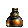
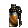
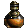
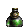
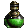
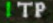
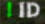
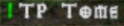
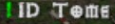

# Gold
Gold values that are displayed:

| LVL | Value |
| --- | --- |
| 1-40 | 100+ |
| 41-80| 2000+|
| 81+ | 4000+ |

# Potions
## Rejuvenation

| Icon | Name | Hide at LVL | Displayed as |
| --- | --- | --- | --- |
|  | Rejuvenation Potion | 66+ | ToDo |
|  | Full Rejuvenation Potion | never | ToDo |

## Health

| Icon | Name | Hide at LVL | Displayed as |
| --- | --- | --- | --- |
|  | Minor Healing Potion | 15+ | ToDo |
|  | Light Healing Potion | 18+ | ToDo |
|  | Healing Potion | 24+ | ToDo |
|  | Greater Healing Potion | 81+ | ToDo |
|  | Super Healing Potion | never | ToDo |

## Mana

| Icon | Name | Hide at LVL | Displayed as |
| --- | --- | --- | --- |
|  | Minor Mana Potion | 15+ | ToDo |
|  | Light Mana Potion | 20+ | ToDo |
|  | Mana Potion | 26+ | ToDo |
|  | Greater Mana Potion | 81+ | ToDo |
|  | Super Mana Potion | never | ToDo |

## Others

| Icon | Name | Hide at LVL | Displayed as |
| --- | --- | --- | --- |
|  | Antidote | always | -/- |
|  | Thawing | always | -/- |
|  | Stamina | always | -/- |
|  | Fulminating | always | -/- |
|  | Exploding Potion | always | -/- |
|  | Oil Potion | always | -/- |
|  | Strangling Gas Potion | always | -/- |
|  | Choking Gas Potion | always | -/- |
|  | Rancid Gas Potion | always | -/- |

# Utility

| Icon | Name | Hide at LVL | Displayed as |
| --- | --- | --- | --- |
|  | Town Portal Scroll | never |  |
|  | Identification Scroll | never |  |
|  | Tome of Town Portal | never |  |
|  | Tome of Identification | never |  |
|  | Key | never | |

# PoD Items
Always Displayed:

# Quests