# Runes / Gems
Runes will be highlighted based on rarity and crafting (popular recipes) relevance. Lower "not that useful" Runes will be grey on high LVL.

Flawless and Perfect Gems will always be shown in orange (as they're relevant for crafting) with a gem-color-indicator.

Lower Gems will only show up for low LVL Characters.

## Gems

| Icon | Name | Hide at LVL | Displayed as |
| --- | --- | --- | --- |
| 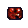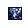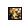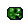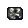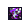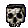 | Chipped Gems | 26+ | unchanged |
| 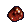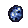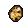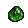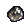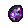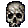 | Flawed Gems | 26+ | unchanged |
| 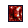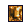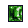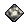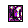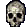 | Regular Gems | 26+ | unchanged |
| 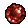 | Flawless Ruby | never | f~Ruby |
| 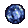 | Flawless Sapphire | never | f~Sapphire |
| 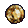 | Flawless Topaz | never | f~Topaz |
| 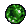 | Flawless Emerald | never | f~Emerald |
| 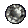 | Flawless Diamond | never | f~Diamond |
| 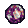 | Flawless Amethyst | never | f~Amethyst |
|  | Flawless Skull | never | f~Skull |
| 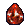 | Perfect Ruby | never | P~RUBY |
| 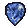 | Perfect Sapphire | never | P~SAPPHIRE |
| 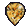 | Perfect Topaz | never | P~TOPAZ |
| 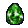 | Perfect Emerald | never | P~EMERALD |
| 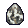 | Perfect Diamond | never | P~DIAMOND |
| 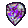 | Perfect Amethyst | never | P~AMETHYST |
|  | Perfect Skull | never | P~SKULL |

## Runes

Crafting indicators consist of recipe type and item type.

| Recipe | Tag |
| --- | --- |
| Blood Belt | B_Be |
| Blood Gloves | B_Gl |
| Blood Ring | B_Ri |
| Caster Amulet | C_Am |
| Caster Belt | C_Be |
| Caster Boots | C_Bo |
| Hit Power Gloves | H_Gl |

| Icon | Name | Condition | Displayed as |
| --- | --- | --- | --- |
|  | El Rune | LVL < 80 | [\>El\<] (1) |
|  | El Rune | LVL 80+ | [\>El\<] (1) |
| 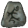 | Eld Rune | LVL < 80 | [\>Eld\<] (2) |
|  | Eld Rune | LVL 80+ | [\>Eld\<] (2) |
|  | Tir Rune | LVL < 80 | [\>Tir\<] (3) |
|  | Tir Rune | LVL 80+ | [\>Tir\<] (3) |
|  | Nef Rune | always | [\>Nef\<] (4) ~B_Gl |
| 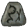 | Eth Rune | LVL < 80 | [\>Eth\<] (5) |
|  | Eth Rune | LVL 80+ | [\>Eth\<] (5) |
| 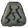 | Ith Rune | always | [\>Ith\<] (6) ~C_Be |
|  | Tal Rune | always | [\>Tal\<] (7) ~B_Be |
| 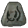 | Ral Rune | always | [\>Ral\<] (8) ~C_Am |
| 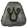 | Ort Rune | always | [\>Ort\<] (9) ~H_Gl |
| 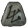 | Thul Rune | always | [\>Thul\<] (10) ~C_Bo |
| 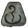 | Amn Rune | always | [\>Amn\<] (11) ~C_Ri |
|  | Sol Rune | always | [\>Sol\<] (12) ~B_Ri |
| 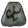 | Shael Rune | LVL < 80 | [\>Shael\<] (13) |
|  | Shael Rune | LVL 80+ | [\>Shael\<] (13) |
| 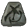 | Dol Rune | LVL < 80 | [\>Dol\<] (14) |
|  | Dol Rune | LVL 80+ | [\>Dol\<] (14) |
| 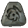 | Hel Rune | LVL < 80 | [\>Hel\<] (15) |
|  | Hel Rune | LVL 80+ | [\>Hel\<] (15) |
| 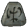 | Io Rune | LVL < 80 | [\>Io\<] (16) |
|  | Io Rune | LVL 80+ | [\>Io\<] (16) |
|  | Lum Rune | always | [\>Lum\<] (17) |
| 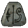 | Ko Rune | always | [\>Ko\<] (18) |
| 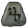 | Fal Rune | always | [\>Fal\<] (19) |
| 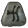 | Lem Rune | always | [\>Lem\<] (20) |
| 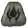 | Pul Rune | always | [\>Pul\<] (21) |
| 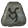 | Um Rune | always | [\>Um\<] (22) |
| 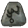 | Mal Rune | always | [\>Mal\<] (23) |
| 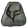 | Ist Rune | always | [\>Ist\<] (24) |
|  | Gul Rune | always | [\>Gul\<] (25) |
|  | Vex Rune | always | ¤[\>Vex\<]¤ (26) |
|  | Ohm Rune | always | ¤[\>Ohm\<]¤ (27) |
|  | Lo Rune | always | ¤[\>Lo\<]¤ (28) |
|  | Sur Rune | always | ¤[\>Sur\<]¤ (29) |
|  | Ber Rune | always | ¤[\>Ber\<]¤ (30) |
|  | Jah Rune | always | ¤[\>Jah\<]¤ (31) |
|  | Cham Rune | always | ¤[\>Cham\<]¤ (32) |
|  | Zod Rune | always | [\>Zod\<] (33) |